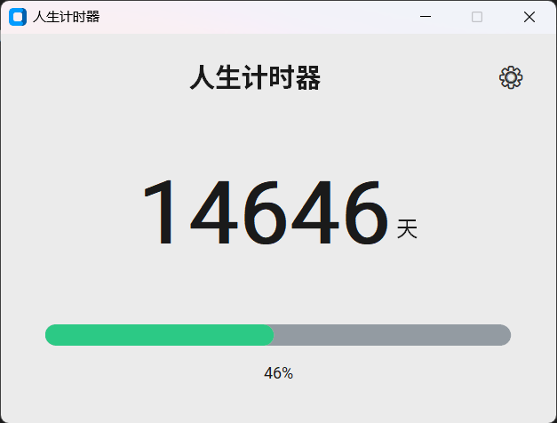
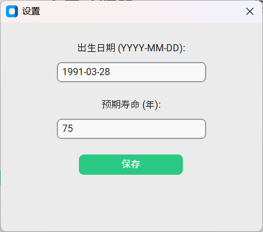

凯文凯利在《未来的5000天》这本书中根据预期寿命为自己的电脑桌面做了个倒计时，以天为单位比以年为单位更加能够显示出生命的尺度。

因此，我将这个倒计时作为我的一个小项目，用python语言实现。

用户界面：

页面说明：
1. 页面顶部显示文字“人生计时器”，和一个齿轮图标，齿轮图标点击后可以显示一个设置页面。

2. 页面中间显示倒计时，以天为单位，显示当前剩余的天数。

3. 页面底部显示进度条，显示当前剩余的天数占总天数的百分比。

使用Python customtkinter实现